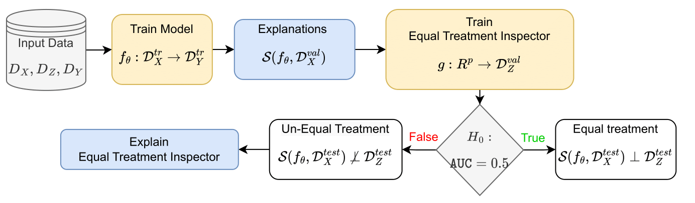
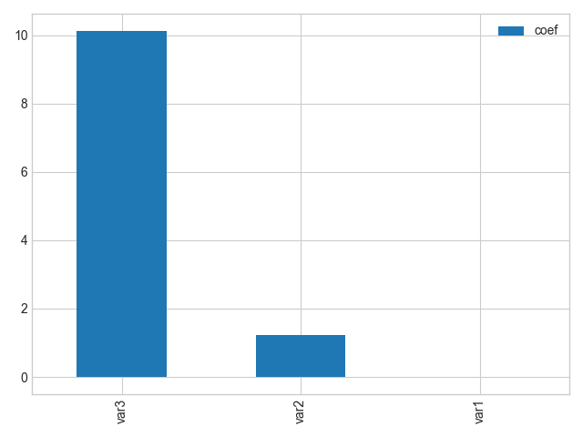
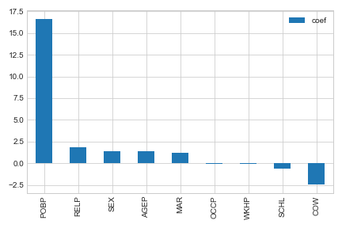

[](https://github.com/psf/black)
[](https://opensource.org/licenses/MIT)

# Equal Treatment: Fairness Measures via the Explanation Space
>Even if deployed with the best intentions, machine learning methods can perpetuate, amplify or even create social biases. Measures of
(un)fairness has been proposed as a way to gauge the (non)discriminatory nature of machine learning models. 
However, proxies of protected attributes causing discriminatory effects remain challenging to address. In this work, we propose a  new algorithmic approach that measures group-wise demographic parity violations and allows us to inspect the causes of inter-group discrimination. Our method relies on the novel idea of measuring the dependence of a model on the protected attribute based on the explanation space, an informative space that allows for more sensitive audits than the primary space of input data or prediction distributions, and allowing for the assertion of theoretical demographic parity auditing guarantees. We provide  a mathematical analysis, synthetic examples, and experimental evaluation of real-world data. We release an open-source Python package with methods, routines, and tutorials.


<p align="center">
  
</p>


To run the code, you need to install the packages listed in `requirements_tutorial.txt`. The code is written in Python 3.10
```python
from fairtools.detector import ExplanationAudit
import pandas as pd
import numpy as np
from sklearn.linear_model import LogisticRegression
from xgboost import XGBRegressor
```


# Tutorial with Synthetic Dataset

```python
# Create synthetic data
N = 5_000
x1 = np.random.normal(1, 1, size=N)
x2 = np.random.normal(1, 1, size=N)
x34 = np.random.multivariate_normal([1, 1], [[1, 0.5], [0.5, 1]], size=N)
x3 = x34[:, 0]
x4 = x34[:, 1]
# Binarize protected attribute - Named var4
x4 = np.where(x4 > np.mean(x4), 1, 0)
X = pd.DataFrame([x1, x2, x3, x4]).T
X.columns = ["var%d" % (i + 1) for i in range(X.shape[1])]
y = 1 / (1 + np.exp(-(x1 + x2 + x3) / 3))
```

```python
detector = ExplanationAudit(model=XGBRegressor(), gmodel=LogisticRegression())
detector.fit(X, y, Z="var4")
detector.get_auc_val()
```

```python
detector.get_auc_val()
#0.73
```
```python
coefs = detector.gmodel.coef_[0]
coefs = pd.DataFrame(coefs, index=X.columns[:-1], columns=["coef"]).sort_values("coef", ascending=False)
coefs.plot(kind="bar")
```

<p align="center">
  
</p>

## Tutorial on Real Dataset
```python
# Load data from the folktables package
from folktables import ACSDataSource, ACSIncome

data_source = ACSDataSource(survey_year="2014", horizon="1-Year", survey="person")
acs_data = data_source.get_data(states=["CA"], download=True)
ca_features, ca_labels, ca_group = ACSIncome.df_to_numpy(acs_data)
X, y, _ = ACSIncome.df_to_numpy(acs_data)
X = pd.DataFrame(X, columns=ACSIncome.features)
# White vs ALL
X["RAC1P"] = np.where(X["RAC1P"] == 1, 1, 0)
```

```python
detector = ExplanationAudit(
        model=XGBRegressor(random_state=0), gmodel=LogisticRegression()
    )
detector.fit(X, y, Z="RAC1P")
```

```python
detector.get_auc_val()
#0.7
```
```python
coefs = detector.get_coefs()
coefs = pd.DataFrame(coefs, index=X.columns[:-1], columns=["coef"]).sort_values("coef", ascending=False)
coefs.plot(kind="bar")
```

<p align="center">
  
</p>
