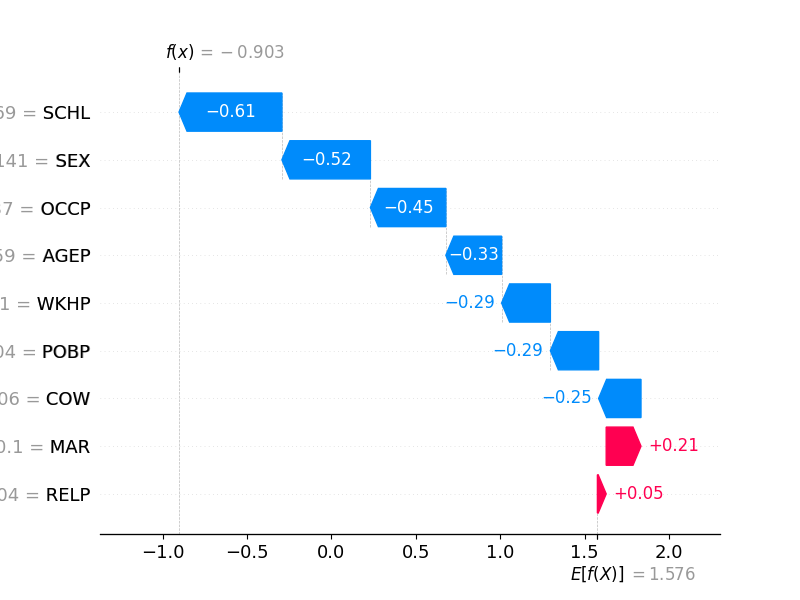
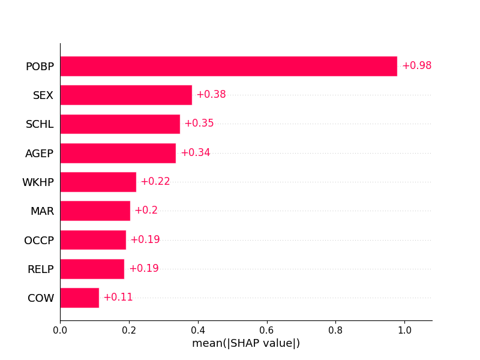

[](https://github.com/psf/black)
[](https://opensource.org/licenses/MIT)

# Equal Treatment: Fairness Measures via the Explanation Space
>Libertarian redistribution justice argues that all individuals should be treated equally independently of their protected characteristics. A similar notion in the fair machine learning literature has been equality of outcomes often translated as demographic or statistical parity, which only measures the final outcome, even if there is unequal model treatment. We propose a new method that reflects libertarian philosophical principles more accurately and allows for interpretable measures. We define the explanation space as the space of all feature contributions to the prediction where we measure the equal treatment of individuals. Our approaches come with theoretical properties about the model and protected attribute independence. We study the proposed approach on synthetic and real data.


<p align="center">
  
</p>


To run the code, you need to install the packages listed in `requirements_tutorial.txt`. The code is written in Python 3.10
```python
from sklearn.model_selection import train_test_split
from sklearn.datasets import make_blobs
from explanationspace import ExplanationAudit
from xgboost import XGBClassifier
from sklearn.linear_model import LogisticRegression
from sklearn.metrics import roc_auc_score
import pandas as pd
import numpy as np
import random
import matplotlib.pyplot as plt
random.seed(0)
```


# Tutorial with Synthetic Dataset

```python
X, y = make_blobs(n_samples=2000, centers=2, n_features=5, random_state=0)
X = pd.DataFrame(X, columns=["a", "b", "c", "d", "e"])
# Protected att
X["a"] = np.where(X["a"] > X["a"].mean(), 1, 0)

# Train Val Holdout Split
X_tr, X_te, y_tr, y_te = train_test_split(X, y, test_size=0.5, random_state=0)
X_hold, X_te, y_hold, y_te = train_test_split(X_te, y_te, test_size=0.5, random_state=0)

z_tr = X_tr["a"]
z_te = X_te["a"]
z_hold = X_hold["a"]
X_tr = X_tr.drop("a", axis=1)
X_te = X_te.drop("a", axis=1)
X_hold = X_hold.drop("a", axis=1)
# Random
z_tr_ = np.random.randint(0, 2, size=X_tr.shape[0])
z_te_ = np.random.randint(0, 2, size=X_te.shape[0])
z_hold_ = np.random.randint(0, 2, size=X_hold.shape[0])
```

Now there is two training options that are equivalent, 
either passing a trained model and just training the Inspector

Fit ET Inspector where the classifier is a Gradient Boosting Decision Tree and the Detector a logistic regression. Any other classifier or detector can be used.

```python
# Option 1: fit the auditor when there is a trained model
model = XGBClassifier().fit(X_tr, y_tr)

auditor = ExplanationAudit(model=model, gmodel=LogisticRegression())

auditor.fit_inspector(X_hold, z_hold)
print(roc_auc_score(z_te, auditor.predict_proba(X_te)[:, 1]))
# 0.84
```

Or fit the whole pipeline without previous retraining.
If the AUC is above 0.5 then we can expect and change on the model predictions.

```python
# Option 2: fit the whole pipeline of model and auditor at once
auditor.fit_pipeline(X=X_tr, y=y_tr, z=z_tr)
print(roc_auc_score(z_te, auditor.predict_proba(X_te)[:, 1]))
# 0.83

# If we fit to random protected att, there is no performance
# We fit in the previous generated random data
auditor.fit_pipeline(X=X_tr, y=y_tr, z=z_tr_)
print(roc_auc_score(z_te_, auditor.predict_proba(X_te)[:, 1]))
# 0.5
```

## Tutorial on Real Dataset
In this case we use the US Income dataset. 
The dataset is available in the `Folktables <https://github.com/socialfoundations/folktables>`_ repository.

We generate a geopolitical shift by training on California data and evaluating on other states.
```python
# Real World Example - Folktables
from folktables import ACSDataSource, ACSIncome
import pandas as pd

data_source = ACSDataSource(survey_year="2018", horizon="1-Year", survey="person")
ca_data = data_source.get_data(states=["CA"], download=True)
ca_features, ca_labels, ca_group = ACSIncome.df_to_pandas(ca_data)
ca_features = ca_features.drop(columns="RAC1P")
ca_features["group"] = ca_group
ca_features["label"] = ca_labels
# Lets focus on groups 1 and 6
ca_features = ca_features[ca_features["group"].isin([1, 6])]

# Split train, test and holdout
X_tr, X_te, y_tr, y_te = train_test_split(
  ca_features.drop(columns="label"), ca_features.label, test_size=0.5, random_state=0
)
X_hold, X_te, y_hold, y_te = train_test_split(X_te, y_te, test_size=0.5, random_state=0)
# Prot att.
z_tr = np.where(X_tr["group"].astype(int) == 6, 0, 1)
z_te = np.where(X_te["group"].astype(int) == 6, 0, 1)
z_hold = np.where(X_hold["group"].astype(int) == 6, 0, 1)
X_tr = X_tr.drop("group", axis=1)
X_te = X_te.drop("group", axis=1)
X_hold = X_hold.drop("group", axis=1)
# Fit the model
model = XGBClassifier().fit(X_tr, y_tr)
```

The model is trained on CA data, where we measure un-equal treatment between two ethnic groups 1 and 6
```python
auditor = ExplanationAudit(model=model, gmodel=XGBClassifier())

auditor.fit_inspector(X_te, z_te)
print(roc_auc_score(z_hold, auditor.predict_proba(X_hold)[:, 1]))
```
The AUC is high which means that there is unequal treatment.
 We can now proceed to inspect the reason behind this un-equal treatment

```python
explainer = shap.Explainer(auditor.inspector)

shap_values = explainer(auditor.get_explanations(X_hold))
# Local Explanations
shap.waterfall_plot(shap_values[0], show=False)

# Global Explanations
hap.plots.bar(shap_values, show=False)
```
```python
coefs = detector.get_coefs()
coefs = pd.DataFrame(coefs, index=X.columns[:-1], columns=["coef"]).sort_values("coef", ascending=False)
coefs.plot(kind="bar")
```

<p align="center">
  
</p>

Above local explanations, below global explanations

<p align="center">
  
</p>
